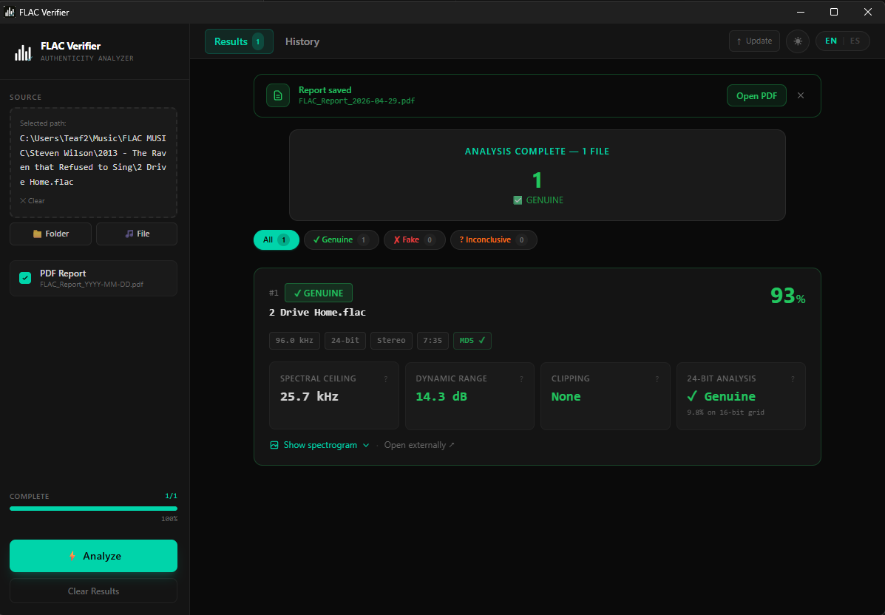

<div align="center">

# 🎵 FLAC Verifier

[](https://www.gnu.org/licenses/gpl-3.0)
[]()
[]()
[](https://github.com/FraysKosher/flac-verifier/releases/latest)
[](https://github.com/FraysKosher/flac-verifier/releases)
[](README.md)

**Detecta automáticamente archivos FLAC upscaled o falsos lossless** — para audiófilos, archivistas y cualquiera que quiera saber qué hay realmente dentro de su colección musical.

[**⬇ Descargar**](#instalación) · [**Cómo funciona**](#cómo-funciona) · [**Compilar desde código**](#opción-b--ejecutar-desde-el-código-fuente)

</div>

---

## ¿Por qué FLAC Verifier?

Una gran parte de los archivos "FLAC 24-bit hi-res" que circulan online son falsos:

- **MP3 o AAC reencodado a FLAC** — fuente lossy dentro de un contenedor lossless
- **16-bit upsampleado a 24-bit** — zero-padding, sin resolucín extra real
- **Clippeado y renormalizado** — audio dañado más allá de 0 dBFS y reempaquetado

FLAC Verifier realiza un **análisis completo espectral, de profundidad de bits y de rango dinámico** sobre cada archivo de una carpeta, y asigna a cada uno un veredicto con puntuación: **Lossless Genuine**, **Probably Lossless**, **Doubtful** o **Probable Upscale**.

> Sin cuenta. Sin conexión a internet. 100% local.

---

## Captura de pantalla

<p align="center">
  
</p>

---

## Características

- 📊 **Análisis espectral completo** — analiza el archivo entero sin límite de duración
- 🖼️ **Espectrogramas obligatorios** — cada archivo genera un PNG, sin opción de omitirlo
- 🏷️ **Cuatro niveles de veredicto** — puntuación 0–100% con etiquetas claras: `LOSSLESS GENUINE` / `PROBABLY LOSSLESS` / `DOUBTFUL` / `PROBABLE UPSCALE`
- 📄 **Reportes PDF + CSV** — por carpeta y un historial maestro en `%APPDATA%\flac-verifier\`
- 🔍 **Barra de filtros** — filtrado por veredicto con un clic
- 🌗 **Tema oscuro / claro** — interruptor en la barra superior, preferencia guardada
- 🌐 **Interfaz EN / ES** — localización completa en inglés y español
- 🔔 **Notificaciones de escritorio** — aviso de Windows al terminar el análisis
- 🔄 **Auto-updater** — verificación silenciosa al iniciar; pregunta solo cuando hay versión nueva

---

## Cómo funciona

```
Tu archivo FLAC
     │
     ▼
┌──────────────────────────────┐
│  1. Extracción de metadatos   │  Sample rate, bit depth, canales
│  2. Análisis espectral        │  FFT → detección de rolloff
│  3. Análisis de bit depth     │  Profundidad real vs. declarada
│  4. Rango dinámico            │  DR score + detección de clipping
│  5. Fingerprinting de encoder │  Patrones LAME, AAC, Opus
└──────────────────────────────┘
     │
     ▼
  Puntuación (0–100) + Veredicto + Lista de problemas
```

---

## Precisión

| Caso | Precisión esperada |
|---|---|
| Zero-padding 16→24 bit | ~97% |
| MP3 128–192 kbps → FLAC | ~95% |
| AAC 256 kbps → FLAC | ~88% |
| LAME 320 kbps → FLAC | ~75% |

> Ante la duda, confía en el espectrograma. Los transcodes de alta calidad son difíciles por diseño.

---

## Requisitos

| Requisito | Versión mínima |
|---|---|
| **Sistema operativo** | Windows 10 / 11 (x64) |
| **Python** | 3.10 |
| **Node.js** | 18 (solo para ejecutar desde código) |
| **Rust** | 1.77 (solo para ejecutar desde código) |

---

## Instalación

### Opción A — Instalador precompilado (recomendado)

1. Ve a la [última versión](https://github.com/FraysKosher/flac-verifier/releases/latest)
2. Descarga `FLAC.Verifier_<version>_x64-setup.exe`
3. Ejecuta el instalador — las dependencias de Python ya están incluidas

### Opción B — Ejecutar desde el código fuente

```bash
# 1. Clonar el repositorio
git clone https://github.com/FraysKosher/flac-verifier.git
cd flac-verifier

# 2. Instalar dependencias de Python
pip install -r requirements.txt

# 3. Instalar dependencias de Node y arrancar
cd flac-verifier
npm install
npm run tauri dev
```

---

## Uso

Abre la app desde el menú Inicio o con `npm run tauri dev` (desde código).

1. **Selecciona una carpeta** — arrastra una carpeta con archivos `.flac` al área de carga
2. **Haz clic en Analizar** — los resultados aparecen tarjeta por tarjeta
3. **Revisa los veredictos** — usa los filtros para ver solo Genuino, Fake o Inconcluso
4. **Exporta** — activa el checkbox de PDF antes de analizar para generar un reporte

### CLI (motor Python directamente)

```bash
python motor_flac.py --ruta "C:/Music/MiAlbum" --pdf
```

| Argumento | Descripción |
|---|---|
| `--ruta` | Ruta a una carpeta o archivo `.flac` (requerido) |
| `--pdf` | Genera un reporte PDF y un CSV junto a la carpeta analizada |

---

## Nota sobre el tiempo de análisis

FLAC Verifier analiza **el archivo completo** — no hay límite de duración.

| Tamaño del álbum | Tiempo aproximado |
|---|---|
| 10 archivos × 4 min | ~30–60 segundos |
| 15 archivos × 8 min | ~2–4 minutos |
| 30 archivos × 10 min | ~5–10 minutos |

---

## Estructura del proyecto

```
flac-verifier/          ← Frontend Tauri + React
  src/                  ← Componentes React, hooks, i18n
  src-tauri/            ← Shell Rust, capacidades, íonos
motor_flac.py           ← Motor de análisis en Python
docs/                   ← Landing page en GitHub Pages
requirements.txt        ← Dependencias de Python
```

---

## Roadmap

- [x] Detección espectral + bit depth + clipping
- [x] Auto-updater + reportes PDF
- [x] Interfaz bilingüe EN/ES
- [ ] Análisis de noise floor (NFH)
- [ ] Detección de pre-echo para transcodes de alta calidad
- [ ] Fingerprinting de encoder (LAME, AAC, Opus)
- [ ] Exportación CSV/JSON del historial completo

---

## Licencia

Este proyecto está licenciado bajo la **GNU General Public License v3.0**.  
Ver el archivo [LICENSE](LICENSE) para el texto completo.
